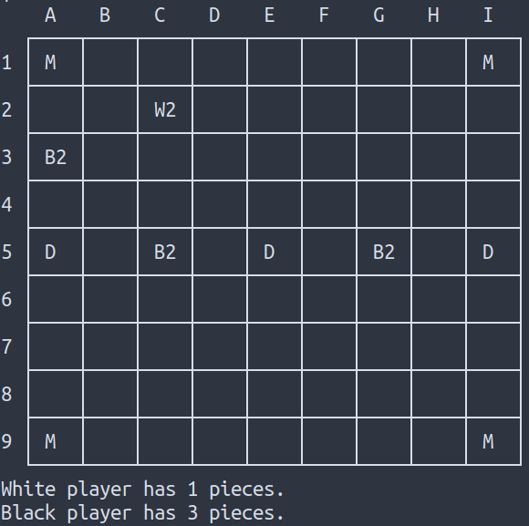

# Three Dragons - Board Game

Project for the Logic Programming course 2020

---
## Identificação
#### Turma 2, Grupo Three_Dragons_4
- João Diogo Martins Romão (up201806779)
- Rafael Valente Cristino (up201806680)


## Descrição do jogo

<!-- Descrição do jogo e das suas regras. Incluir ligações usadas (página do jogo, livro de regras...). -->

O tabuleiro do jogo é constituído por uma grelha 9x9, com uma *montanha* em cada canto e três *caves de dragão* no centro (ver a ligação 'Tabuleiro' em baixo).

Um dos conceitos chave é o de "Captura Custodial". A peça do jogador adversário é capturada quando é rodeada em lados opostos com duas peças, ou então com uma peça e uma *cave de dragão* ou com uma peça e uma *montanha*.

O jogo começa com o jogador que tem as peças brancas. As peças podem ser movidas ortogonalmente, qualquer numero de quadrados (como a torre do xadrez). Não podem ser ocupados os quadrado onde existirem *montanhas* ou *caves de dragão*.

Quando uma peça é capturada, é removida do tabuleiro.

O jogo termina quando um dos jogadores tiver apenas uma peça, sendo o que tiver mais peças no tabuleiro o vencedor.

**Notas:**
- Um jogador pode mover a sua peça entre duas peças adversárias sem ser capturado (não pode é deixar a peça no meio delas).
- Uma jogada pode capturar mais do que uma peça do adversário.

### Variantes

**Captura por poder**

Uso de dados em vez de peças brancas e pretas. O número de cada dado voltado para cima indica o poder de cada peça.

Adiciona-se um novo modo de captura: quando se termina um movimento e se deixa a peça junto a uma das peças do adversário, e a nossa peça tem poder maior que a outra.

*Notas:* terminar o movimento ao lado de uma peça do adversário com maior poder não resulta na captura da peça movida; Captura por poder apenas pode capturar uma peça de cada vez; Se ocorrer captura custodial e captura por poder ao mesmo tempo, o jogador escolhe qual prefere.

**Captura por poder + dragões**

Adiciona à variante de captura por poder.

Guardados três dados de lado (que serão os dragões). Cada uma das caves de dragão pode invocar um dragão apenas uma vez. 

Se o jogador for o primeiro a rodear uma dada cave de dragão em todos os lados, coloca-se um dragão por cima da cave, que passa a fazer parte do arsenal do jogador. 

As caves dos lados fazem aparecer dragões com 3 pontos de poder; a do centro um dragão com 5 pontos de poder.


### Ligações
[Página do jogo](https://boardgamegeek.com/boardgame/306972/three-dragons)

[Regras](https://drive.google.com/file/d/1WECUYhpHmKJimMTosrjJz_ZRqtwFB25M/view?usp=sharing)

[Tabuleiro](https://drive.google.com/file/d/1RkYiaxLTF0aXfGMNxtuH8Z0a9UlHSgjb/view?usp=sharing)

## Representação interna do estado do jogo
<!--Indicação de como é representado o estado do jogo, incluindo tabuleiro, jogador atual, peças capturadas ou ainda por jogar / outras informações necessárias. Exemplos da representação em Prolog de estados *inicial*, *intermédio* e *final*. Indicação do significado de cada átomo.-->

### Tabuleiro

O tabuleiro será representado com o recurso de uma lista de listas. 

#### Representação do número de peças de cada jogador

O número de peças de cada jogador encontra-se representado pelo primeiro elemento da lista de listas que constitui o tabuleiro. O primeiro número corresponde ao jogador 0, das peças brancas, e o segundo ao jogador 1, das peças pretas.

#### Representação de cada átomo
No modo básico do jogo cada elemento do tabuleiro poderá apenas tomar os seguintes valores:

- empty - célula vazia;
- black - peças pretas;
- white - peças brancas;
- mountain - peças "montanha" que se enontram em cada canto do tabuleiro;
- dragonCave - peças "cave do dragão" que se encontram numa posição central do tabuleiro.

#### Estado Inicial
```prolog
board([
	[8, 8],   % player 0 - 8 peças (brancas); player 1 - 8 peças (pretas)
	[mountain, black, black, black, black, black, black, black, mountain],
	[empty, empty, empty, empty, black, empty, empty, empty, empty],
	[empty, empty, empty, empty, empty, empty, empty, empty, empty],
	[empty, empty, empty, empty, empty, empty, empty, empty, empty],
	[dragonCave, empty, empty, empty, dragonCave, empty, empty, empty, dragonCave],
	[empty, empty, empty, empty, empty, empty, empty, empty, empty],
	[empty, empty, empty, empty, empty, empty, empty, empty, empty],
	[empty, empty, empty, empty, white, empty, empty, empty, empty],
	[mountain, white, white, white, white, white, white, white, mountain]
]).
```

#### Possível Estado intermédio
```prolog
board([
	[6, 7],   % player 0 - 6 peças (brancas); player 1 - 7 peças (pretas)
	[mountain, empty, black, empty, black, empty, black, empty, mountain],
	[empty, empty, empty, empty, black, empty, empty, empty, white],
	[empty, empty, empty, empty, empty, empty, white, empty, empty],
	[empty, empty, empty, empty, black, empty, empty, empty, empty],
	[dragonCave, empty, empty, empty, dragonCave, empty, empty, empty, dragonCave],
	[white, empty, empty, black, empty, empty, empty, empty, empty],
	[empty, empty, empty, empty, empty, empty, empty, empty, black],
	[empty, empty, empty, empty, white, empty, empty, empty, empty],
	[mountain, empty, white, empty, empty, white, empty, empty, mountain]
]).
```

#### Possível Estado final
O jogo termina quando um dos jogadores tem apenas 1 peça (neste caso o jogador 0). O vencedor é o jogador 1 (peças pretas).
```prolog
board([
	[1, 5],   % player 0 - 1 peça (branca); player 1 - 5 peças (pretas)
	[mountain, empty, black, empty, empty, empty, black, empty, mountain],
	[empty, empty, empty, empty, empty, empty, empty, empty, empty],
	[empty, empty, empty, empty, empty, empty, empty, empty, empty],
	[empty, empty, empty, empty, black, empty, empty, empty, empty],
	[dragonCave, empty, empty, empty, dragonCave, empty, empty, empty, dragonCave],
	[empty, empty, empty, black, empty, empty, empty, empty, empty],
	[empty, empty, empty, empty, empty, empty, empty, empty, black],
	[empty, empty, empty, empty, empty, empty, empty, empty, empty],
	[mountain, empty, white, empty, empty, empty, empty, empty, mountain]
]).
```

## Visualização do estado do jogo
<!--Pequena descrição da implementação do predicado de visualização do estado de jogo. Até 200 palavras.-->

O predicado **play/0** inicia o jogo.

O predicado de visualização **display_game(+GameState, +Player)** representa o limite superior do tabuleiro e recorre ao predicado **display_board/1** para representar o atual estado de jogo.

O predicado **display_board(+GameState)** representa o tabuleiro linha a linha, chamando o predicado **display_row/1**, o qual representa cada linha do tabuleiro.

O predicado **display_edge_row/1** representa apenas a última linha do tabuleiro de forma a este apresentar a forma de grelha presente nas imagens em baixo anexadas.

Os predicados **display_board_line/0**, **display_board_top_line/0** e **display_board_bottom_line/0** são responsáveis por representar a linhas horizontais que delimitam cada célula do tabuleiro.

O predicado **display_players_pieces/1** apresenta no ecrã o número de peças que cada jogador possui em jogo.

O predicado **display_player/1** apresenta no ecrã o jogador atual.

Cada átomo presente no tabuleiro é representado por uma letra que lhe é associada da seguinte forma:

```prolog
symbol(mountain, 'M').
symbol(black, 'B').
symbol(empty, ' ').
symbol(white, 'W').
symbol(dragonCave, 'D').
```

Representação inicial  |  Possível representação intermédia  |  Possível representação final
:---------------------:|:-----------------------------------:|:------------:
  |                |   

