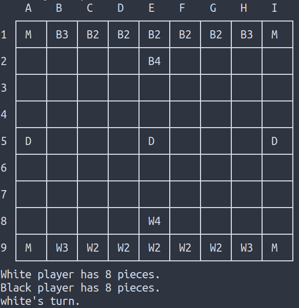
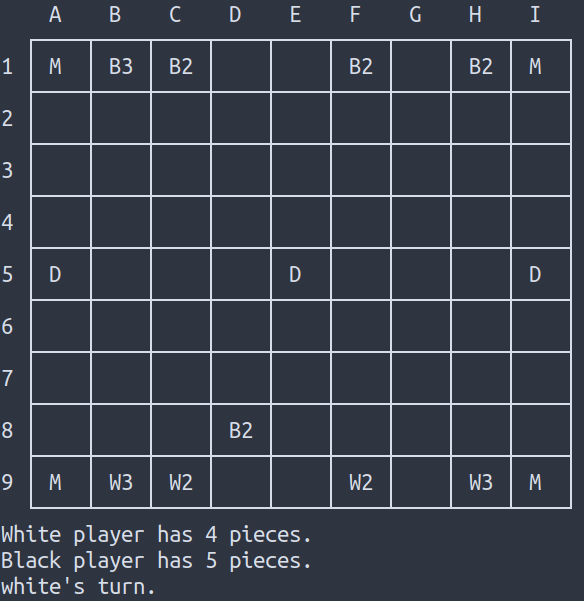

# Three Dragons - Board Game

Project for the Logic Programming course 2020

---
## Identificação
#### Turma 2, Grupo Three_Dragons_4
- João Diogo Martins Romão (up201806779)
- Rafael Valente Cristino (up201806680)

## Instalação e execução
Para executar o jogo, basta ter o SICStus 4.6.0 instalado, quer em Windows como Linux. Para abrir o jogo deve ser inserido `consult('game.pl').`, e para começar o jogo, `play.`.

## Descrição do jogo

<!-- Descrição do jogo e das suas regras. Incluir ligações usadas (página do jogo, livro de regras...). -->

O tabuleiro do jogo é constituído por uma grelha 9x9, com uma *montanha* em cada canto e três *caves de dragão* no centro (ver a ligação 'Tabuleiro' em baixo).

Um dos conceitos chave é o de "Captura Custodial". A peça do jogador adversário é capturada quando é rodeada em lados opostos com duas peças, ou então com uma peça e uma *cave de dragão* ou com uma peça e uma *montanha*.

O jogo começa com o jogador que tem as peças brancas. As peças podem ser movidas ortogonalmente, qualquer numero de quadrados (como a torre do xadrez). Não podem ser ocupados os quadrado onde existirem *montanhas* ou *caves de dragão*.

Quando uma peça é capturada, é removida do tabuleiro.

O jogo termina quando um dos jogadores tiver apenas uma peça, sendo o que tiver mais peças no tabuleiro o vencedor.

**Notas:**
- Um jogador pode mover a sua peça entre duas peças adversárias sem ser capturado.
- Uma jogada pode capturar mais do que uma peça do adversário, no caso da captura custodial.

<div style="page-break-after: always"></div>

### Variantes

**Captura por poder**

Uso de dados em vez de peças brancas e pretas. O número de cada dado voltado para cima indica o poder de cada peça.

Adiciona-se um novo modo de captura: quando se termina um movimento e se deixa a peça junto a uma das peças do adversário, e a nossa peça tem poder maior que a outra.

*Notas:* terminar o movimento ao lado de uma peça do adversário com maior poder não resulta na captura da peça movida; Captura por poder apenas pode capturar uma peça de cada vez.

**Captura por poder + dragões**

Adiciona à variante de captura por poder.

Guardados três dados de lado (que serão os dragões). Cada uma das caves de dragão pode invocar um dragão apenas uma vez. 

Se o jogador for o primeiro a rodear uma dada cave de dragão em todos os lados, coloca-se um dragão por cima da cave, que passa a fazer parte do arsenal do jogador. 

As caves dos lados fazem aparecer dragões com 3 pontos de poder; a do centro um dragão com 5 pontos de poder.

***Durante a realização deste trabalho, o jogo foi implementado com todas as variantes.***
### Ligações
[Página do jogo](https://boardgamegeek.com/boardgame/306972/three-dragons) (https://boardgamegeek.com/boardgame/306972/three-dragons)

[Regras](https://drive.google.com/file/d/1WECUYhpHmKJimMTosrjJz_ZRqtwFB25M/view?usp=sharing) (https://drive.google.com/file/d/1WECUYhpHmKJimMTosrjJz_ZRqtwFB25M/view?usp=sharing)

[Tabuleiro](https://drive.google.com/file/d/1RkYiaxLTF0aXfGMNxtuH8Z0a9UlHSgjb/view?usp=sharing) (https://drive.google.com/file/d/1RkYiaxLTF0aXfGMNxtuH8Z0a9UlHSgjb/view?usp=sharing)

<div style="page-break-after: always"></div>

## Lógica do jogo

### Representação interna do estado do jogo
<!--Indicação de como é representado o estado do jogo, incluindo tabuleiro, jogador atual, peças capturadas ou ainda por jogar / outras informações necessárias. Exemplos da representação em Prolog de estados *inicial*, *intermédio* e *final*. Indicação do significado de cada átomo.-->

#### Tabuleiro

O tabuleiro será representado com o recurso a uma lista de listas. 

#### Representação do número de peças de cada jogador

O número de peças de cada jogador encontra-se representado pelo primeiro elemento da lista de listas que constitui o tabuleiro. O primeiro número corresponde ao jogador 0, das peças brancas, e o segundo ao jogador 1, das peças pretas.

#### Representação do jogador atual

O jogador atual é obtido como parâmetro no predicado *display_game*, sendo previamente definido como sendo o contrário do jodador anterior (se o jogador anterior foi o jogador 0, então o jogador atual será o jogador 1) através do recurso ao predicado *toggle_player(+CurrentPlayer, -NextPlayer)*. No inicio, o jogador é inicializado através do recurso ao predicado *initial_player(-Player)*.

#### Representação de cada átomo
No modo básico do jogo cada elemento do tabuleiro poderá apenas tomar os seguintes valores:

- `empty` - célula vazia;
- `dice(black, Valor)` - peças pretas, onde `Valor` é o valor da peça;
- `dice(white, Valor)` - peças brancas, onde `Valor` é o valor da peça;
- `mountain` - peças "montanha" que se enontram em cada canto do tabuleiro;
- `dragonCave(empty)` - peças "cave do dragão" que se encontram numa posição central do tabuleiro;
- `dragonCave(invoked)` - peças "cave do dragão" que se encontram numa posição central do tabuleiro cuja peça do dragão associada já foi invocada;

<div style="page-break-after: always"></div>

#### Estado Inicial
```prolog
% board(-Board)
% Unifies 'Board' with the initial board
board([
	[mountain, dice(black, 3), dice(black, 2), dice(black, 2), dice(black, 2), dice(black, 2), dice(black, 2), dice(black, 3), mountain],
	[empty, empty, empty, empty, dice(black, 4), empty, empty, empty, empty],
	[empty, empty, empty, empty, empty, empty, empty, empty, empty],
	[empty, empty, empty, empty, empty, empty, empty, empty, empty],
	[dragonCave(empty), empty, empty, empty, dragonCave(empty), empty, empty, empty, dragonCave(empty)],
	[empty, empty, empty, empty, empty, empty, empty, empty, empty],
	[empty, empty, empty, empty, empty, empty, empty, empty, empty],
	[empty, empty, empty, empty, dice(white, 4), empty, empty, empty, empty],
	[mountain, dice(white, 3), dice(white, 2), dice(white, 2), dice(white, 2), dice(white, 2), dice(white, 2), dice(white, 3), mountain]
]).
```

#### Possível Estado intermédio
```prolog
% board(-Board)
% Unifies 'Board' with the initial board
board([
	[mountain, dice(black, 3), dice(black, 2), empty, empty, dice(black, 2), empty, dice(black, 2), mountain],
	[empty, empty, empty, empty, empty, empty, empty, empty, empty],
	[empty, empty, empty, empty, empty, empty, empty, empty, empty],
	[empty, empty, empty, empty, empty, empty, empty, empty, empty],
	[dragonCave(empty), empty, empty, empty, dragonCave(empty), empty, empty, empty, dragonCave(empty)],
	[empty, empty, empty, empty, empty, empty, empty, empty, empty],
	[empty, empty, empty, empty, empty, empty, empty, empty, empty],
	[empty, empty, empty, dice(black, 2), empty, empty, empty, empty, empty],
	[mountain, dice(white, 3), dice(white, 2), empty, empty, dice(white, 2), empty, dice(white, 3), mountain]
]).
```

<div style="page-break-after: always"></div>

#### Possível Estado final
O jogo termina quando um dos jogadores tem apenas 1 peça.
```prolog
% board(-Board)
% Unifies 'Board' with the initial board
board([
	[mountain, empty, empty, empty, empty, empty, empty, empty, mountain],
	[empty, empty, dice(white, 2), empty, empty, empty, empty, empty, empty],
	[dice(black, 2), empty, empty, empty, empty, empty, empty, empty, empty],
	[empty, empty, empty, empty, empty, empty, empty, empty, empty],
	[dragonCave(empty), empty, dice(black, 2), empty, dragonCave(empty), empty, dice(black, 2), empty, dragonCave(empty)],
	[empty, empty, empty, empty, empty, empty, empty, empty, empty],
	[empty, empty, empty, empty, empty, empty, empty, empty, empty],
	[empty, empty, empty, dice(black, 2), empty, empty, empty, empty, empty],
	[mountain, empty, empty, empty, empty, empty, empty, empty, mountain]
]).
```

### Visualização do estado do jogo
<!--Pequena descrição da implementação do predicado de visualização do estado de jogo. Até 200 palavras.-->

O predicado **play/0** inicia o jogo.

O predicado de visualização **display_game(+GameState, +Player)** representa o limite superior do tabuleiro e recorre ao predicado **display_board/2** para representar o atual estado de jogo.

O predicado **display_board(+GameState)** representa o tabuleiro linha a linha, chamando o predicado **display_row/1**, o qual representa cada linha do tabuleiro.

O predicado **display_edge_row/1** representa apenas a última linha do tabuleiro de forma a este apresentar a forma de grelha presente nas imagens em baixo anexadas.

Os predicados **display_board_separator/0**, **display_board_top_separator/0** e **display_board_bottom_separator/0** são responsáveis por representar a linhas horizontais que delimitam cada célula do tabuleiro.

O predicado **display_players_pieces/1** apresenta no ecrã o número de peças que cada jogador possui em jogo.

O predicado **display_player/1** apresenta no ecrã o jogador atual.

<div style="page-break-after: always"></div>

Cada átomo presente no tabuleiro é representado por uma letra que lhe é associada da seguinte forma:

```prolog
symbol(mountain, 'M').
symbol(black, 'B').
symbol(empty, ' ').
symbol(white, 'W').
symbol(dragonCave(empty), 'D').
symbol(dragonCave(invoked), 'DI').
```

Representação inicial  |  Possível representação intermédia  |  Possível representação final
:---------------------:|:-----------------------------------:|:------------:
  |                |   

<div style="page-break-after: always"></div>

#### Sistema de menus

##### Menu inicial

<center></center>

No menu inicial o utilizador tem a opção de escolher três modos de jogo distintos, podendo o utilizador escolher a sua opção selecionando [1, 2, 3] para as respetivas opções: 
- Jogador contra Jogador;
- Jogador contra Computador;
- Computador contra Computador.

Caso o utilizador escolha alguma opção que envolva o Computador será redirecionado para um menu de selceção de dificuldade que funciona de forma idêntica ao anterior. 

```prolog
% router(+WhereTo)
% Establishes correspondence between a main menu option and the associated predicate
router(WhereTo) :-
    (WhereTo = 1 -> start_pvp_game ; (
        WhereTo = 2 -> difficulty_menu(Difficulty), start_pvm_game(Difficulty) ; (
            WhereTo = 3 -> difficulty_menu(Difficulty), start_mvm_game(Difficulty) ; (
                WhereTo = 4 -> true ; print('Don\'t know how you got here...\n')
            )
        )
    )).
```

<div style="page-break-after: always"></div>

##### Menu Game Over

<center></center>

Funciona de forma idêntica ao menu inicial sendo que apenas possui duas opções:
- Continuar a jogar, redirecionando o utilizador para o menu inicial
- Terminar o jogo 

```prolog
% game_over_router(+WhereTo)
% Establishes correspondence between a main menu option and the associated predicate
game_over_router(WhereTo) :-
    (WhereTo = 1 -> play ; (
        WhereTo = 2 -> true ; print('Don\'t know how you got here...\n')
    )).
```

##### Validação de opções do menu

O jogador, sempre que insere input no programa, isere-o na consola, premindo ENTER no final (não é necessário terminar com '.').

```prolog
% verify_digit_input(+Min, +Max, +Input, -Out)
% Succeeds if 'Input' is a digit between Min and Max (including), unifying 'Out' with the digit
verify_digit_input(Min, Max, Input, Out) :-
    length(Input, 1),
    nth0(0, Input, D),
    get_digit_from_num_code(D, Out),
    Out >= Min, Out =< Max.

% get_digit_input(+Min, +Max, -Input)
% Unifies 'Input' with a valid digit between Min and Max (including)
get_digit_input(Min, Max, Input) :-
    read_line(Line),
    (
        verify_digit_input(Min, Max, Line, Input)

        -> true
        ; print('That is not a valid option!'), nl, get_digit_input(Min, Max, Input)
    ).
```

<div style="page-break-after: always"></div>

### Lista de jogadas válidas
<!-- Obtenção de lista com jogadas possíveis. O predicado
deve chamar-se valid_moves(+GameState, +Player, -ListOfMoves). -->

A lista de jogadas válidas é obtida da seguinte forma:
1. Obtenção da lista de peças do jogador.
```prolog
findall(piecePosition(Position, dice(Player, N)), (    % finds all of the player's pieces
	nth_board_element(GameBoard, Position, dice(Player, N))
), PlayersPieces).
```
2. Cálculo e concatenação da lista de jogadas possíveis para cada uma das peças.
```prolog
% valid_piece_moves(+GameBoard, +PiecePosition, -Moves)
% 'Moves' is unified with the valid piece moves that the piece given in 'PiecePosition' can make in the current 'GameBoard'
valid_piece_moves(GameBoard, piecePosition(position(X, Y), Piece), Moves) :-
    findall(move(position(X, Y), position(X1, Y1), Piece), (
        (X1 = X ; Y1 = Y),  % has got to be orthogonal
        nth_board_element(GameBoard, position(X1, Y1), empty) % can only move to an empty position
    ), Moves).

% valid_moves_from_pieces(+GameBoard, +Pieces, -Moves)
% 'Moves' is unified with all the possible moves that can be made for each of the 'Pieces' in the current 'GameBoard'
valid_moves_from_pieces(_GameBoard, [], []).
valid_moves_from_pieces(GameBoard, [PiecesH|PiecesT], Moves) :-
    valid_piece_moves(GameBoard, PiecesH, PieceMoves),
    valid_moves_from_pieces(GameBoard, PiecesT, MovesTemp),
    append(MovesTemp, PieceMoves, Moves).
```
3. Permutação aleatória da lista obtida, para maximizar o não determinismo no caso das jogadas do computador.
```prolog
    random_permutation(ListOfMovesTemp, ListOfMoves).
```

<div style="page-break-after: always"></div>

Estes três passos são executados no predicado `valid_moves/3`:
```prolog
% valid_moves(+GameState, +Player, -ListOfMoves)
% 'ListOfMoves' is unified with all the moves the 'Player' can make in the current 'GameState'
valid_moves(game_state(_Player, _NPieces, GameBoard), Player, ListOfMoves) :-
    findall(piecePosition(Position, dice(Player, N)), (    % Passo 1.
        nth_board_element(GameBoard, Position, dice(Player, N))
    ), PlayersPieces),
    valid_moves_from_pieces(GameBoard, PlayersPieces, ListOfMovesTemp), % Passo 2
    random_permutation(ListOfMovesTemp, ListOfMoves). % Passo 3.
```

### Execução de Jogadas
<!-- Validação e execução de uma jogada, obtendo o novo
estado do jogo. O predicado deve chamar-se move(+GameState, +Move,
-NewGameState). -->

Uma vez recebida e processada a jogada do utilizador esta é aplicada com recurso ao predicado `move/3`.

Numa primeira fase é **aplicada a jogada** movendo a peça selecionada para o local pretendido e atualizando o estado de jogo em `apply_move/3`.

De seguida verifica-se se houve **captura por custódia ou por poder**, adicionando devidamente as peças a adicionar ou remover a listas inidicadas em `get_changed_pieces/4`, sendo o **número de peças** de cada jogador de seguida **atualizado** em `update_player_piece_count/3`.

Em `apply_changed_pieces/4` são introduzidas no estado de jogo as **alterações** provocadas pelo movimento da peça.

Por fim, verifica-se se alguma **cave do dragão foi ativada**, atualizado o estado da respetiva cave, indicando que já invocou um dragão, sendo o respetivo dragão colocado no tabuleiro em `check_dragons/2`.

```prolog
% move(+GameState, +Move, -NewGameState)
% Performs a player move
% Applies the user move, checks if there were any eaten pieces or any invoked dragons 
move(GameState, Move, NewGameState) :-
	apply_move(Move, GameState, TempGameState),
	get_changed_pieces(Move, TempGameState, PiecesToRemove, PiecesToAdd),
	update_player_piece_count(PiecesToRemove, TempGameState, TempGameState1),
	apply_changed_pieces(PiecesToRemove, PiecesToAdd, TempGameState1, TempGameState2),
	check_dragons(TempGameState2, NewGameState).	
```

<div style="page-break-after: always"></div>

### Final do Jogo
<!-- Verificação do fim do jogo, com identificação do vencedor. O
predicado deve chamar-se game_over(+GameState, -Winner). -->

O final do jogo acontece quando um dos jogadores se vê reduzido a apenas uma peça. Esta verificação é executada pelo predicado `game_over/2`. Este predicado falha se o jogo ainda não tiver terminado, e sucede quando um dos jogadores apenas tem uma peça, unificando `Winner` com o jogador vencedor (o jogador com mais de uma peça).
```prolog
% game_over(+GameState, -Winner)
% Interprets game state and verifies if game is over
% Game ends when one of the players has only one piece on the board
game_over(GameState, Winner) :-
	GameState =.. [_PredName, _Player, npieces(WhiteCount, BlackCount), _Board],
	((WhiteCount =:= 1 -> Winner = black ; false);
	(BlackCount =:= 1 -> Winner = white ; false)),
	display_game(GameState, -1).
```


### Avaliação do Tabuleiro
<!-- Forma(s) de avaliação do estado do jogo. O predicado
deve chamar-se value(+GameState, +Player, -Value). -->

De forma a avaliar o estado do tabuleiro, temos disponível o predicado `value/3`, que baseando-se no estado atual e no jogador especificado em `Player`, unifica `Value` com o valor de peças do jogador. A manutenção da quantidade de peças de cada jogador é realizada no `GameState`, no qual é alterada sempre que for adicionada/removida uma peça.


```prolog
% value(+GameState, +Player, -Value)
% Evaluation of the state of the game.
% Unifies 'Value' with the amount of pieces that the 'Player' has in-game
value(game_state(_Player, npieces(Value, _NBlackPieces), _GameBoard), white, Value).
value(game_state(_Player, npieces(_NWhitePieces, Value), _GameBoard), black, Value).
```

<div style="page-break-after: always"></div>

### Jogada do Computador
<!--  Escolha da jogada a efetuar pelo computador,
dependendo do nível de dificuldade. O predicado deve chamar-se
choose_move(+GameState, +Player, +Level, -Move). -->

A jogada do computador é obtida através do predicado `choose_move/4`:

```prolog
% choose_move(+GameState, +Player, +Level, -Move)
% 'Move' is unified with the next player move, depending on the current difficulty 'Level'
choose_move(GameState, Player, Level, Move) :-
    valid_moves(GameState, Player, PossibleMoves),
    (Level = easy -> choose_move_easy(PossibleMoves, Move) ; (
        Level = medium -> choose_move_medium(GameState, Player, PossibleMoves, Move) ; (
            Level = hard -> choose_move_hard(GameState, Player, PossibleMoves, Move) ; print('Invalid difficulty \''), print(Level), print('\'!\n')
        )
    )).
```

Para a jogada do computador, foram considerados os seguintes níveis:
#### Dificuldade Fácil
A escolha da jogada é através da seleção de um membro aleatório da lista de todas as jogadas possíveis.

```prolog
% choose_move_easy(+PossibleMoves, -Move)
% 'Move' is unified with the next easy difficulty move.
choose_move_easy(PossibleMoves, Move) :-
    random_member(Move, PossibleMoves).   % Easy difficulty is just random moves
```

<div style="page-break-after: always"></div>

#### Dificuldade Média

Para a dificuldade média, foram considerados os seguintes itens, sendo um número menor associado a uma prioridade maior:
1. Se for possível **invocar um dragão**, então invocar.
2. Se for possível **capturar uma peça por captura custodial**, então capturar.
3. Se for possível **capturar uma peça por poder**, então capturar.
4. Escolher aleatóriamente a partir da lista de todas as jogadas possíveis (apenas se não for possível nenhuma das anteriores).

```prolog
% choose_move_medium(+GameState, +Player, +PossibleMoves, -Move)
% 'Move' is unified with the next medium difficulty move for 'Player', in the current 'GameState'.
choose_move_medium(GameState, Player, PossibleMoves, Move) :-   % The first priority is creating a dragon if possible
    print('Checking can make dragon...\n'),
    can_make_dragon(Player, GameState, PossibleMoves, Move), !.
choose_move_medium(GameState, _Player, PossibleMoves, Move) :-  % The second is eating a piece by custodial capture
    print('Checking can capture custodial...\n'),
    can_capture_custodial(GameState, PossibleMoves, Move), !.
choose_move_medium(GameState, _Player, PossibleMoves, Move) :-  % The third is eating a piece by capture by power
    print('Checking can capture by power...\n'),
    can_capture_by_power(GameState, PossibleMoves, Move), !.
choose_move_medium(_GameState, _Player, PossibleMoves, Move) :- % Lastly, the bot chooses randomly
    random_member(Move, PossibleMoves), !.
```

#### Dificuldade Difícil

Para a dificuldade média, considerámos as particularidades da dificuldade média e adicionámos mais algumas:
1. Se for possível **invocar um dragão**, então invocar.
2. Se for possível **capturar uma peça por captura custodial**, então capturar.
3. Se for possível **capturar uma peça por poder**, então capturar.
4. Se for possível encontrar uma jogada intermédia para **na próxima ronda conseguir capturar uma peça**, então jogar.
5. Se for possível **'salvar' uma das nossas peças** então salvar.
6. Se for possível **mover para próximo de um dragão sem correr risco de ser capturado**, então mover (tendo como objetivo eventualmente invocar um dragão).
7. Escolher aleatóriamente a partir da lista de todas as jogadas possíveis (apenas se não for possível nenhuma das anteriores).

<div style="page-break-after: always"></div>

```prolog
% choose_move_hard(+GameState, +Player, +PossibleMoves, -Move)
% 'Move' is unified with the next hard difficulty move for 'Player', in the current 'GameState'.
choose_move_hard(GameState, Player, PossibleMoves, Move) :-     % The first priority is creating a dragon if possible
    print('Checking can make dragon...\n'),
    can_make_dragon(Player, GameState, PossibleMoves, Move), !.
choose_move_hard(GameState, _Player, PossibleMoves, Move) :-    % The second is eating a piece by custodial capture
    print('Checking can capture custodial...\n'),
    can_capture_custodial(GameState, PossibleMoves, Move), !.
choose_move_hard(GameState, _Player, PossibleMoves, Move) :-    % The third is eating a piece by capture by power
    print('Checking can capture by power...\n'),
    can_capture_by_power(GameState, PossibleMoves, Move), !.
choose_move_hard(GameState, _Player, PossibleMoves, Move) :-    % The fourth is moving to an intermediate position that will let us eat next round
    print('Finding a position to eat next round...\n'),
    can_capture_next_round(GameState, PossibleMoves, Move), !.  
choose_move_hard(GameState, _Player, PossibleMoves, Move) :-    % the fifth is removing a piece from danger
    print('Avoiding losing one of my pieces...\n'),
    avoid_being_captured(GameState, PossibleMoves, Move), !.
choose_move_hard(GameState, _Player, PossibleMoves, Move) :-    % the sixth is moving towards a dragon, in the effor to invoke one
    print('Moving towards a dragon...\n'),
    move_towards_dragon(GameState, PossibleMoves, Move), !.
choose_move_hard(_GameState, _Player, PossibleMoves, Move) :-   % Lastly, the bot chooses randomly
    random_member(Move, PossibleMoves).
```

<div style="page-break-after: always"></div>

## Conclusões

Ao longo da execução trabalho, tivemos a oportunidade de nos familiarizarmos com o Prolog e com a programação declarativa. Consideramos que foi desenvolvido um trabalho robusto, e que as competências desenvolvidas deixam margem para, no futuro, implementar aplicações com este tipo de programação de um modo mais atrativo e amigável para o utilizador.

### Limitações do trabalho desenvolvido

Após testar o nosso trabalho não encontrámos nenhuma falha/erro (algo que não funciona conforme o esperado).

### Melhorias identificadas

Uma zona onde há espaço a melhorar é a escolha da jogada do computador. Para além das estratégias implementadas, há espaço a dar mais prioridade à **invocação de dragões**, de forma a que a invocação destes torne o jogo mais competitivo. Outra melhoria possível seria, dentro de cada uma dessas estratégias, dar prioridades mais adequadas às peças, consoante o seu valor. Por exemplo, ao capturar uma peça por captura custodial, caso se tenha mais que uma opção, optar por capturar a peça de maior valor. Ao ter mais que uma peça em perigo, optar por salvar a que tiver maior valor.

## Bibliografia

SICStus Prolog 4.6.0 - User's Manual - https://sicstus.sics.se/sicstus/docs/latest4/html/sicstus.html/
